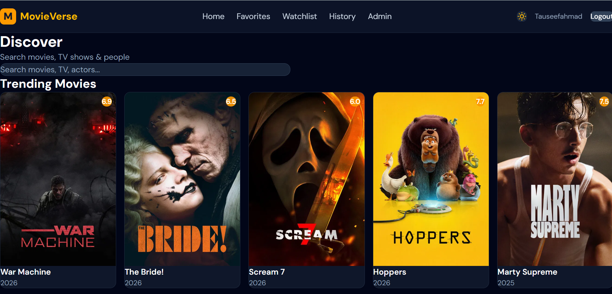
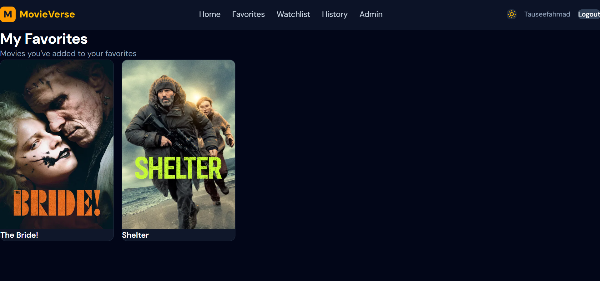
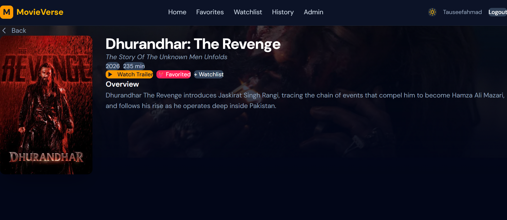
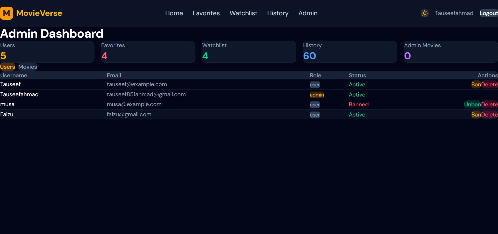
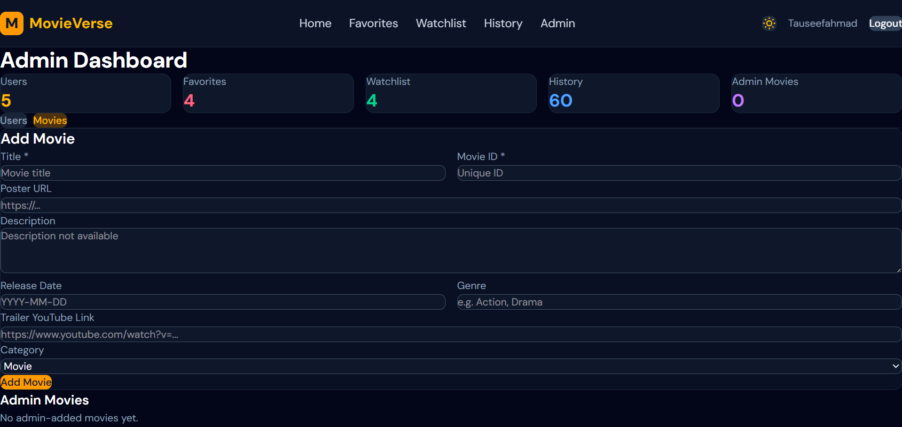

# 🎬 MovieVerse – Full Stack Movie Platform

MovieVerse is a full stack movie discovery platform where users can explore trending movies, search for movies, watch trailers, and manage their personal movie collections.

This project demonstrates a complete full stack architecture with authentication, API integration, state management, and user personalization features.

---

## 🚀 Features

### 👤 User Features
- User Registration & Login (JWT Authentication)
- Explore Trending Movies
- Search Movies in Real Time
- View Movie Details
- Watch Movie Trailers
- Add Movies to Favorites
- Create and Manage Watchlist
- Track Watch History

### 🛠 Admin Features
- Add new movies to the platform
- Ban users
- Delete users
- Manage platform content

---

## 🧑‍💻 Tech Stack

### Frontend
- React
- Redux Toolkit
- React Router
- Tailwind CSS

### Backend
- Node.js
- Express.js

### Database
- MongoDB

### Authentication
- JWT (JSON Web Token)

### External API
- TMDB API

---

## 📸 Screenshots

### Home Page

### Favorites Page

### Movie Details Page

### Admin Dashboard Page

- Home Page  
- Favorites / Watchlist Page  
- Movie Details Page    
- Admin Dashboard

---

## 🔮 Future Improvements

- Movie recommendation system
- User reviews and ratings
- Better UI/UX improvements

---

## 📌 Author

**Tauseef Ahmad**

GitHub: https://github.com/realtauseefahmad

---
